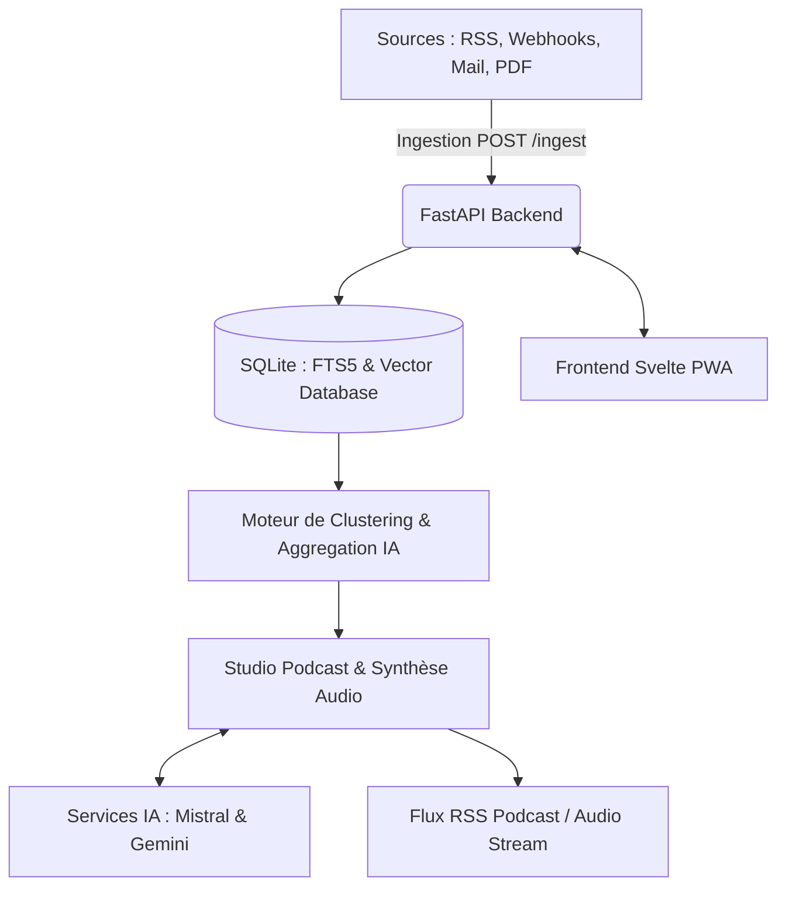

# 🎙️ Voce — AI Reader, Intelligent News Hub & Automated Podcast Studio

**Voce** (anciennement *Vos*) est une application web PWA moderne d'agrégation d'actualités, d'ingestion universelle de contenus et de génération automatique de podcasts audio pilotée par l'Intelligence Artificielle (Mistral AI et Google Gemini).

Conçue comme un centre de veille complet et un studio de création audio personnel, **Vocce** permet de centraliser, nettoyer, regrouper visuellement et synthétiser vocalement vos sources d'information (flux RSS, newsletters, webhooks, dépêches et articles web).

---

## 🌟 Fonctionnalités Principales

### 1. Ingestion Universelle & Nettoyage Intelligente

* **Point d'entrée Webhook unique (`/api/v1/webhooks/ingest`)** : Intercepte et stocke n'importe quelle source issue d'automatisations (n8n, Make, scripts Python, Mailhooks.dev, newsletters).
* **Assistant "Clic & Valide" (Zero Code)** : Analyse le code HTML brut via l'IA Mistral pour découper les documents en blocs sémantiques et créer des filtres de nettoyage personnalisés en un clic.
* **Catalogue RSS massif & Auto-découverte** : Recherche rapide dans le catalogue de flux grâce à la recherche plein texte SQLite FTS5.

### 2. Studio Podcast & Moteur Audio IA

* **Génération Automatique de Podcasts** : Programmation et planification automatique de résumés audio périodiques.
* **Flux RSS Podcast officiel (`/api/podcast/feed.xml`)** : Génération d'un flux natif compatible avec Apple Podcasts, Pocket Casts, Spotify, etc.
* **Streaming binaire haute performance (MediaSource API / MSE)** : Démarrage quasi-instantané de la lecture audio pendant que les segments de synthèse sont récupérés en arrière-plan.
* **Voix & Personnalisation** : Variété d'intonations/voix selon les thèmes abordés, insertion de jingles sonores personnalisables (Whoosh, etc.) et prompts système sur mesure pour la synthèse.

### 3. Vues & Expérience Visuelle Avancée

* **Clustering & Synthèse Thématique (Mode Perplexity)** : Regroupement automatique des actualités similaires par calcul de proximité.
* **Étagères 3D Culture** : Présentation dynamique et thématique (Cinéma, Séries, Littérature, etc.) des actualités avec gestion de flux dédiés.
* **Carte Interactive (GeoMap)** : Géolocalisation et visualisation cartographique mondiale des informations.
* **PWA & Design Moderne** : Interface responsive (Svelte + Tailwind CSS), installable comme application native sur desktop et mobile.

### 4. Pilotage & Quotas IA (Tokenomics)

* **Tableau de Bord des Jetons IA** : Suivi rigoureux de la consommation de jetons (Mistral AI et Google Gemini) ventilé par usage (synthèse d'articles, traitement webhook, podcasts).
* **Gestion des limites & cadencement API** : Configuration dynamique des quotas, seuils de similarité et limites par lots de vectorisation.

---

## 🛠️ Stack Technique

| Domaine | Technologies Utilisées |
| --- | --- |
| **Frontend** | Svelte / SvelteKit, Vite (PWA), Tailwind CSS |
| **Backend** | FastAPI (Python 3.11+), Uvicorn, APScheduler |
| **Bases de données** | SQLite (Module natif FTS5 + `sqlite-vec` pour la recherche vectorielle) |
| **Modèles IA & Audio** | **Mistral AI** (Voxtral, Codestral, Mistral Large), **Google Gemini** (1.5 Flash/Pro) |
| **Déploiement** | Nginx, YunoHost / VPS Linux |



---

## ⚙️ Installation & Démarrage Rapide

### 1. Prérequis

* Python **3.11+**
* Node.js **18+**

### 2. Configuration du Backend

```bash
cd backend
python -m venv venv
source venv/bin/activate  # Sous Windows: venv\Scripts\activate
pip install -r requirements.txt

```

Créez un fichier `.env` basé sur les variables suivantes :

```ini
MISTRAL_API_KEY="votre_cle_mistral"
GEMINI_API_KEY="votre_cle_gemini"

```

Lancement du serveur backend (FastAPI) :

```bash
uvicorn app.main:app --host 127.0.0.1 --port 8000 --reload

```

### 3. Configuration du Frontend

```bash
cd frontend
npm install
npm run dev

```

L'application est directement accessible sur `http://localhost:5173`.

---

## ☁️ Déploiement YunoHost / VPS Nginx

Pour autoriser le streaming audio et l'ingestion webhook en contournant le SSO YunoHost (SSOWat), ajoutez la configuration Nginx suivante dans `/etc/nginx/conf.d/<votre_domaine.tld>.d/vos_rss.conf` :

```nginx
# Bypass SSO YunoHost pour le Webhook Ingest
location /api/v1/webhooks/ingest {
    access_by_lua_block { return; }
    proxy_pass http://127.0.0.1:8000/api/v1/webhooks/ingest;
    proxy_set_header Host $host;
}

# Bypass SSO YunoHost pour le flux RSS XML Podcast
location /api/podcast/feed.xml {
    access_by_lua_block { return; }
    proxy_pass http://127.0.0.1:8000/api/podcast/feed.xml;
    proxy_set_header Host $host;
}

# Bypass SSO YunoHost pour le streaming des fichiers MP3 audio
location /api/audio/stream/ {
    access_by_lua_block { return; }
    proxy_pass http://127.0.0.1:8000/api/audio/stream/;
    proxy_set_header Host $host;
    proxy_force_ranges on; # Support du Seek (Range requests)
}

```

Appliquez les changements :

```bash
sudo nginx -t && sudo systemctl reload nginx

```
